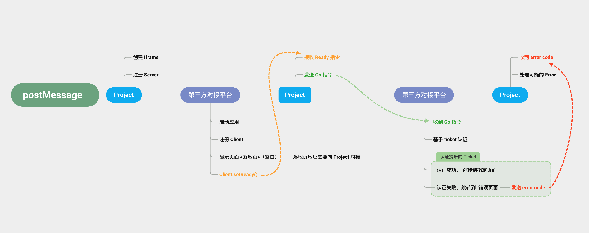
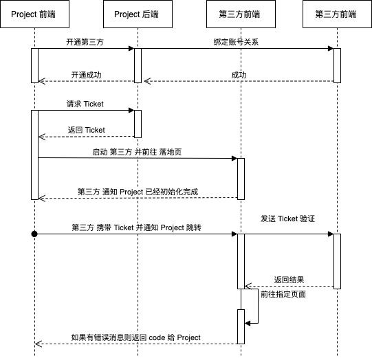

## Tds Msg

### 说明

协议工具包 用于解决 通过 iframe 实现通讯的问题。

### 术语约定

本项目服务端 以下简称 Project
第三方接入平台 以下简称 第三方

### 认证流程



### 时序图



### 安装

1. 通过 npm 方式：

```bash
yarn add @taptap/tds-msg
```

2. 下载 release 包使用

### 使用

#### 客户端使用< 第三方使用 >

```typescript
import Client from "@taptap/tds-msg/es/client";
const client = new TdsClient('http://localhost:3001', {
  // 允许初始化的时候直接绑定
  onGo: function (tdsMsg) {
    // 实现对应的路由操作 
    console.log('go', tdsMsg.path, tdsMsg)
  }
})

// 告诉 Project 自己已经准备完毕可以进行路由操作了
client.setReady();
// 告诉 Project 自己报错了，错误编号为 100
client.setError(100);
// 告诉 Project tikect 过期了，要重发
client.refreshTicket();
// 告诉 Project 现在需要 sync 同步路径了
client.syncPath({ path: '/' });
// 销毁当前 client 这将移除所有的事件绑定 -> 理论正常情况下不需要调用此方法
client.destroy();

// 基于事件方式监听
client.on(TdsClient.ClientEventGo, function (tdsMsg) {
    console.log('go', tdsMsg.path, tdsMsg)
})
```

> TdsClient 为了保证安全，将会对域名进行校验，所以这里需要在第一个参数传递受信域名 
> 事件的绑定和移除详见 [EventEmitter](https://github.com/primus/eventemitter3)
> 事件名字同 回调函数名 一致，也可如上文所示直接使用 TdsClient.ClientEventGo 等获取 
> 预定义的通用 错误Code 可以参考 TdsClient.ErrorCode

#### 服务端使用 < Project >

```typescript
import Server from "@taptap/tds-msg/es/server";

const server = new TdsServer('http://localhost:3000', () => document.querySelector('iframe'), {
    // 允许初始化的时候直接绑定
    onError: (code) => {
      console.error(`error: ${code}`);
    },
    onReady: (data) => {
      console.log('ready', data)
      server.go('/data', '111', {projectId: '1', orgId: '1'})
    },
    onMessage: (data) => {
      console.log('message', data)
    },
    onRefreshTicket: () => {
      console.log('refreshTick', data)
    },
    onSyncPath: (data) => {
      console.log('syncPath', data)
    }
});
// 基于事件方式监听
server.once(TdsServer.ServerEventReady, function (data) {
  console.log('ready', data);
  server.go('/data', '111', { projectId: '1', orgId: '1' });
})

server.on(TdsServer.ServerEventError,function (data)  {
  console.error(`error:`, data);
})

server.on(TdsServer.ServerEventRefreshTicket,function (data) {
  console.log('refresh', data);
})

server.on(TdsServer.ServerEventSyncPath,function (data) {
  console.log('refresh', data);
})

window.server = server;
```

### 修改源码/查看 demo

```bash
# demo
npm run build
# 查看 demo 
npm run dev
```

demo 请打开 [http://localhost:3000/](http://localhost:3001/) 查看

